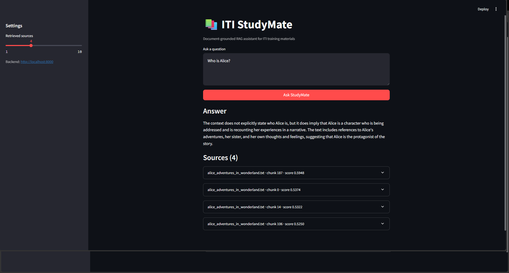
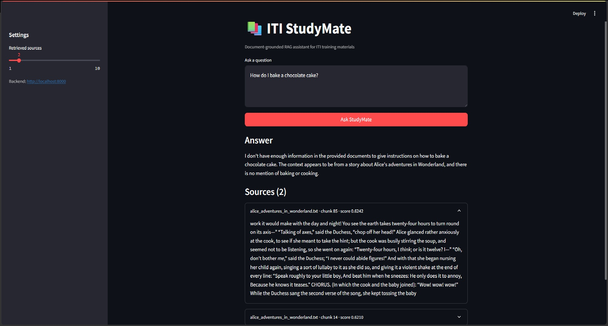

# ITI StudyMate — Grounded RAG Assistant

ITI StudyMate is a document-grounded question-answering application. It retrieves relevant passages from a local document collection, sends only that context to a local Ollama model, and displays the generated answer with traceable source chunks.

## Tech stack

| Layer | Technology | Notes |
|---|---|---|
| Backend API | FastAPI 0.115 + Uvicorn | `/health` and `/query` endpoints, CORS enabled for local dev |
| Validation | Pydantic 2 / pydantic-settings | Request/response schemas + `.env`-driven settings |
| Embeddings | Sentence-Transformers (`all-MiniLM-L6-v2`) | 384-dim normalized vectors |
| Vector store | Chroma (persistent client) | Local on-disk collection `iti_studymate`, L2 space |
| LLM generation | Ollama (`llama3.2:3b`) | Runs locally, called via the `ollama` Python client |
| Frontend | Streamlit | Calls the backend over HTTP via `api_client.py` |
| Document parsing | pypdf | PDF text extraction (plus native Markdown/TXT loading) |
| Testing | pytest + httpx | `backend/tests/test_query.py` |
| Experimentation | Jupyter, pandas, numpy | `notebooks/rag_pipeline.ipynb` — build, retrieve, evaluate |
| Packaging | Docker | `backend/Dockerfile`, built from the repo root |

## Dataset

The demo corpus (`data/documents/`) mixes:

- `iti_rag_notes.md` — original short notes explaining the RAG pipeline itself (what it is, chunking, embeddings, evaluation).
- Three public-domain novels from [Project Gutenberg](https://www.gutenberg.org): *Alice's Adventures in Wonderland*, *Pride and Prejudice*, and *Frankenstein*.

Together these total ~1.3 MB / ~25,000 lines and produce roughly 1,700 chunks at the default chunk size, which is enough to meaningfully exercise chunking, embeddings, and retrieval — see `data/DATASET.md` for full provenance, licensing notes, and suggested evaluation questions. To use real ITI course material instead (or alongside), drop permitted PDF/Markdown/TXT files into `data/documents/` and rerun the notebook ingestion cell with `reset=True`.

## Architecture

```text
PDF / Markdown / TXT
        |
        v
Document loading + cleaning + chunking
        |
        v
Sentence-Transformers embeddings
        |
        v
Persistent Chroma vector store
        |
        v
FastAPI /query  --->  Ollama local LLM
        |
        v
Streamlit answer + source cards
```

## Features

- PDF, Markdown, and TXT ingestion.
- Metadata-aware chunks with source name, optional page, and chunk ID.
- Persistent local Chroma database.
- Local Ollama generation with a grounded-answer instruction.
- FastAPI `/health` and `/query` endpoints.
- Streamlit frontend with loading and error states.
- Ten-question evaluation table in the notebook.

## Project structure

```text
iti-studymate-rag/
├── data/documents/                    # RAG notes + 3 public-domain novels; add permitted course files locally
├── data/DATASET.md                    # Dataset provenance, licensing, and suggested evaluation questions
├── notebooks/rag_pipeline.ipynb       # End-to-end build, retrieval test, and evaluation
├── backend/
│   ├── app/
│   │   ├── main.py                    # FastAPI app, CORS, startup loading via lifespan
│   │   ├── api/routes/query.py        # GET /health, POST /query
│   │   ├── core/config.py             # Settings from .env
│   │   ├── schemas/query.py           # QueryRequest / QueryResponse
│   │   ├── services/
│   │   │   ├── documents.py           # Load, clean, and chunk source documents
│   │   │   ├── retrieval.py           # Chroma vector store: ingest + search
│   │   │   └── generation.py          # Call Ollama LLM, build grounded answer
│   │   └── utils/logging_config.py    # Shared logging setup
│   ├── tests/test_query.py
│   ├── requirements.txt
│   ├── .env.example
│   └── Dockerfile
├── frontend/
│   ├── app.py                         # Streamlit UI
│   ├── api_client.py                  # Wrapper for calling the backend API
│   ├── requirements.txt
│   └── .env.example
├── requirements.txt                   # Aggregate env for local dev (notebook + backend + frontend)
├── .env.example
└── .gitignore
```

## Setup

Python 3.10+ and Git are required. Install Ollama from [ollama.com](https://ollama.com), then pull a small local model:

```bash
python -m venv .venv
# Windows: .venv\\Scripts\\activate
# macOS/Linux: source .venv/bin/activate
pip install -r requirements.txt
cp .env.example .env
ollama pull llama3.2:3b
```

The embedding model is downloaded by Sentence Transformers on first run. If the machine is resource-constrained, change `EMBEDDING_MODEL` in `.env` to `sentence-transformers/all-MiniLM-L6-v2` (the default).

### Environment variables

| Variable | Used by | Default | Description |
|---|---|---|---|
| `OLLAMA_HOST` | backend | `http://localhost:11434` | URL of the local Ollama server |
| `OLLAMA_MODEL` | backend | `llama3.2:3b` | Ollama model tag to use for generation |
| `EMBEDDING_MODEL` | backend, notebook | `sentence-transformers/all-MiniLM-L6-v2` | HuggingFace model used to embed chunks and queries |
| `VECTOR_STORE_PATH` | backend, notebook | `./data/vector_store` | Folder where the persisted Chroma database lives. Backend relative paths are resolved from the project root. |
| `DOCS_PATH` | backend | `./data/documents` | Folder the retriever ingests from if the vector store above is empty. Relative paths are resolved from the project root, so launching Uvicorn from `backend/` is safe; in Docker this is `/app/data/documents`. |
| `TOP_K` | backend | `4` | Default number of chunks retrieved per query if the request doesn't override it |
| `MIN_RETRIEVAL_SCORE` | backend | `0.35` | Minimum cosine-similarity score required before evidence is sent to the LLM. Calibrated against real scores for this corpus + `all-MiniLM-L6-v2` (genuine matches land around 0.50-0.60); re-tune per corpus/model — see notebook section 6b |
| `API_BASE_URL` | frontend | `http://localhost:8000` | Base URL the Streamlit app calls; never hard-code this in `app.py` |

`backend/.env.example` and `frontend/.env.example` each contain only the variables that component needs; the root `.env.example` is the union of both, for running everything from one place during development.

## Vector store schema

There's no relational database here — the persisted store is a Chroma collection. Its shape:

| Field | Type | Notes |
|---|---|---|
| `id` | string | `"{source_filename}::{page_or_'na'}::{chunk_index}"`, unique per chunk |
| `embedding` | float32[384] | Normalized `all-MiniLM-L6-v2` vector |
| `document` (text) | string | The chunk's raw text |
| `metadata.source` | string | Original filename |
| `metadata.page` | int (optional) | PDF page number; absent for `.md`/`.txt` sources |
| `metadata.chunk_id` | int | Chunk index within that source |

Collection name: `iti_studymate`. Similarity space: L2 over normalized vectors, converted to cosine similarity in `retrieval.py` (`score = 1 - distance/2`).

## Build the vector store

Open `notebooks/rag_pipeline.ipynb` and run all cells from top to bottom. The notebook loads the documents in `data/documents/`, creates chunks and embeddings, tests retrieval, and persists Chroma under `data/vector_store/`.

To use your own permitted PDF or text files, place them in `data/documents/` and rerun the notebook. Do not commit copyrighted books, secrets, or large raw corpora to a public repository.

## Run the API

From the repository root:

```bash
uvicorn backend.app.main:app --reload --port 8000
```

If running from inside `backend/`, use:

```bash
uvicorn app.main:app --reload --port 8000
```

Check health:

```bash
curl http://localhost:8000/health
```

Ask a question:

```bash
curl -X POST http://localhost:8000/query \\
  -H "Content-Type: application/json" \\
  -d '{"question":"Why is chunk overlap useful in RAG?"}'
```

## API reference

### `GET /health`

No parameters. Returns service status without touching the vector store or LLM.

**Response `200`**

| Field | Type | Description |
|---|---|---|
| `status` | string | `"ok"` or `"degraded"` |
| `service` | string | Always `"iti-studymate-rag"` |
| `error` | string (optional) | Present only when `status` is `"degraded"`; the startup exception message |

### `POST /query`

**Request body**

| Field | Type | Required | Constraints |
|---|---|---|---|
| `question` | string | yes | 3–1000 characters, non-blank after trimming |
| `top_k` | integer | no | 1–10; defaults to `TOP_K` from settings (`4`) when omitted |

```json
{
  "question": "Why is chunk overlap useful in RAG?",
  "top_k": 4
}
```

**Response `200`**

| Field | Type | Description |
|---|---|---|
| `answer` | string | Grounded answer from the LLM, or a fixed "not enough information" message when no chunk clears `MIN_RETRIEVAL_SCORE` |
| `sources` | array of `Source` | Empty when the answer above is the fallback |

`Source` object:

| Field | Type | Description |
|---|---|---|
| `source` | string | Original filename the chunk came from |
| `chunk_id` | string | Chunk index within that source |
| `page` | integer or null | PDF page number; `null` for `.md`/`.txt` sources |
| `score` | float | Cosine similarity, rounded to 4 decimals |
| `text` | string | The retrieved chunk's raw text |

```json
{
  "answer": "Overlap keeps a sentence that spans two chunks from losing context at the boundary...",
  "sources": [
    {
      "source": "iti_rag_notes.md",
      "chunk_id": "3",
      "page": null,
      "score": 0.5821,
      "text": "Chunk overlap prevents ideas that straddle a chunk boundary from being split..."
    }
  ]
}
```

**Error responses**

| Status | When |
|---|---|
| `422` | `question` fails validation (missing, blank, too short/long) or `top_k` out of range |
| `503` | Retriever/generator failed to load at startup, or is still starting |
| `502` | Ollama call failed (not running, or the configured model isn't pulled) |

## Run the backend with Docker (optional)

The build context must be the repo root, since the image copies both `backend/` and `data/`:

```bash
docker build -f backend/Dockerfile -t iti-studymate-backend .
docker run --rm -p 8000:8000 --add-host=host.docker.internal:host-gateway --env-file backend/.env iti-studymate-backend
```

If Ollama runs on your host machine (not inside the container), set `OLLAMA_HOST=http://host.docker.internal:11434` in `backend/.env` so the container can reach it.

## Run the frontend

In a second terminal:

```bash
streamlit run frontend/app.py
```

The frontend reads `API_BASE_URL` from `.env` and never hard-codes a backend URL in the UI logic.

## Tests

Four tests validate the health endpoint, invalid-question validation (including blank input, both expecting `422`), and the grounded fallback answer when the corpus returns no matching chunks:

```bash
python -m pytest backend/tests -q
```

## Evaluation results

The notebook runs twelve representative questions spanning all four corpus files. Retrieval is scored against an expected source; low-confidence matches below `MIN_RETRIEVAL_SCORE` (0.35) are withheld rather than sent to the LLM, so a "no retrieval" row below is a deliberate abstention, not a bug.

| # | Question | Expected source | Retrieved source | Relevant? |
|---|---|---|---|---|
| 0 | What is RAG? | iti_rag_notes.md | none (below threshold) | no |
| 1 | Why do we split documents into chunks? | iti_rag_notes.md | iti_rag_notes.md | yes |
| 2 | What should the model do when context is missing? | iti_rag_notes.md | none (below threshold) | no |
| 3 | Who is Alice? | alice_adventures_in_wonderland.txt | alice_adventures_in_wonderland.txt | yes |
| 4 | What happens when Alice follows the White Rabbit? | alice_adventures_in_wonderland.txt | alice_adventures_in_wonderland.txt | yes |
| 5 | What does the Queen of Hearts order during the trial? | alice_adventures_in_wonderland.txt | alice_adventures_in_wonderland.txt | yes |
| 6 | What is Elizabeth Bennet's first impression of Mr. Darcy? | pride_and_prejudice.txt | pride_and_prejudice.txt | yes |
| 7 | Why does Mr. Darcy initially object to the relationship? | pride_and_prejudice.txt | pride_and_prejudice.txt | yes |
| 8 | Where does the Bennet family live? | pride_and_prejudice.txt | pride_and_prejudice.txt | yes |
| 9 | What motivates Victor Frankenstein's experiment? | frankenstein.txt | frankenstein.txt | yes |
| 10 | How does the creature learn about human society? | frankenstein.txt | none (below threshold) | no |
| 11 | What does the monster ask Victor to create? | frankenstein.txt | frankenstein.txt | yes |

**Retrieval accuracy: 9/12 (75%).** The 3 misses are documented and explained in notebook section 6b — all three are abstract/definitional questions (not fact-lookup), and their nearest chunk scored below the calibrated threshold, so the system correctly withheld an answer rather than guessing.

## Screenshots

### Answer + cited sources





The screenshot shows a real end-to-end response with the generated answer and retrieved source cards. For a fresh submission run, repeat the demo locally and replace this image if the corpus or UI changes.

### Grounded refusal (below-threshold retrieval)





This shows the assistant correctly declining to answer when no retrieved chunk clears `MIN_RETRIEVAL_SCORE`, instead of guessing — the behavior documented in notebook section 6b.


## Demo script

1. Start Ollama and the API.
2. Start Streamlit.
3. Ask: “Why is chunk overlap useful in a RAG system?”
4. Explain that the answer comes from the retrieved notes, not from an unrestricted web search.
5. Expand the Sources section and point out the source file, chunk ID, score, and supporting text.
6. Ask an unrelated question and show that the assistant reports insufficient document evidence instead of inventing a source.

## Academic integrity

This repository is an independent implementation for the graduation project. Training materials may be used as learning references, but the final code, evaluation questions, documentation, and presentation should be understood and customized by the student. The included demo notes are original; the three novels are public-domain texts from Project Gutenberg used only as a stand-in corpus to demonstrate the pipeline at a realistic scale (see `data/DATASET.md`) — replace or supplement them with real ITI course material for the actual submission if required by the program.

## Troubleshooting

- **`ModuleNotFoundError`**: activate the virtual environment and run `pip install -r requirements.txt`.
- **Ollama error / 502**: start Ollama and confirm the configured model exists with `ollama list`.
- **No useful sources**: add the permitted course files to `data/documents/`, then rerun the notebook ingestion cell with `reset=True`.
- **PDF has no text**: scanned/image-only PDFs need OCR before they can be retrieved by this text-based pipeline.

## Clean rebuild

If the source documents change, delete `data/vector_store/` or run the notebook ingestion cell, which now performs a clean reset before indexing the current corpus.
